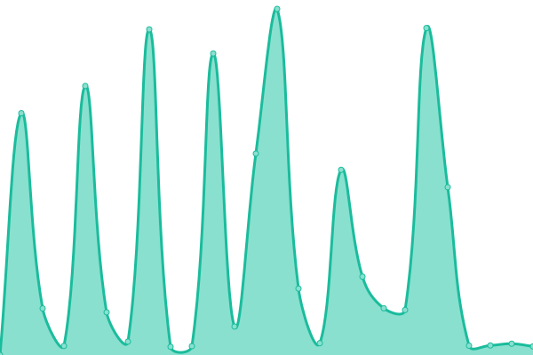

# [📈 Live Status](https://status.boba.best): <!--live status--> **🟩 All systems operational**

This repository contains the open-source uptime monitor and status page for [BBaoVanC](https://bbaovanc.com), powered by [Upptime](https://github.com/upptime/upptime).

With [Upptime](https://upptime.js.org), you can get your own unlimited and free uptime monitor and status page, powered entirely by a GitHub repository. We use [Issues](https://github.com/BBaoVanC/status.boba.best/issues) as incident reports, [Actions](https://github.com/BBaoVanC/status.boba.best/actions) as uptime monitors, and [Pages](https://status.boba.best) for the status page.

<!--start: status pages-->
<!-- This summary is generated by Upptime (https://github.com/upptime/upptime) -->
<!-- Do not edit this manually, your changes will be overwritten -->
<!-- prettier-ignore -->
| URL | Status | History | Response Time | Uptime |
| --- | ------ | ------- | ------------- | ------ |
|  [Main Site](https://boba.best) | 🟩 Up | [main-site.yml](https://github.com/BBaoVanC/status.boba.best/commits/HEAD/history/main-site.yml) | 

 2178ms
     
 | 

<a href="https://status.boba.best/history/main-site">95.39%</a>
    

|  [Gitea](https://git.boba.best) | 🟩 Up | [gitea.yml](https://github.com/BBaoVanC/status.boba.best/commits/HEAD/history/gitea.yml) | 

 3494ms
     
 | 

<a href="https://status.boba.best/history/gitea">94.77%</a>
    

|  [Drone CI](https://drone.boba.best) | 🟩 Up | [drone-ci.yml](https://github.com/BBaoVanC/status.boba.best/commits/HEAD/history/drone-ci.yml) | 

 3299ms
     
 | 

<a href="https://status.boba.best/history/drone-ci">94.90%</a>
    

|  [Mail](https://mail.boba.best) | 🟩 Up | [mail.yml](https://github.com/BBaoVanC/status.boba.best/commits/HEAD/history/mail.yml) | 

 5921ms
     
 | 

<a href="https://status.boba.best/history/mail">93.81%</a>
    

|  [Matrix](https://matrix.boba.best/_matrix/federation/v1/version) | 🟩 Up | [matrix.yml](https://github.com/BBaoVanC/status.boba.best/commits/HEAD/history/matrix.yml) | 

 3916ms
     
 | 

<a href="https://status.boba.best/history/matrix">87.59%</a>
    

|  [PeerTube](https://peertube.boba.best) | 🟩 Up | [peer-tube.yml](https://github.com/BBaoVanC/status.boba.best/commits/HEAD/history/peer-tube.yml) | 

 1480ms
     
 | 

<a href="https://status.boba.best/history/peer-tube">85.92%</a>
    

|  [Pleroma](https://pleroma.boba.best) | 🟩 Up | [pleroma.yml](https://github.com/BBaoVanC/status.boba.best/commits/HEAD/history/pleroma.yml) | 

 1740ms
     
 | 

<a href="https://status.boba.best/history/pleroma">73.12%</a>
    

|  [Vaultwarden](https://vault.boba.best) | 🟩 Up | [vaultwarden.yml](https://github.com/BBaoVanC/status.boba.best/commits/HEAD/history/vaultwarden.yml) | 

 774ms
     
 | 

<a href="https://status.boba.best/history/vaultwarden">85.49%</a>
    

<!--end: status pages-->

[**Visit our status website →**](https://status.boba.best)

## 📄 License

- Powered by: [Upptime](https://github.com/upptime/upptime)
- Code: [MIT](./LICENSE) © [BBaoVanC](https://bbaovanc.com)
- Data in the `./history` directory: [Open Database License](https://opendatacommons.org/licenses/odbl/1-0/)
